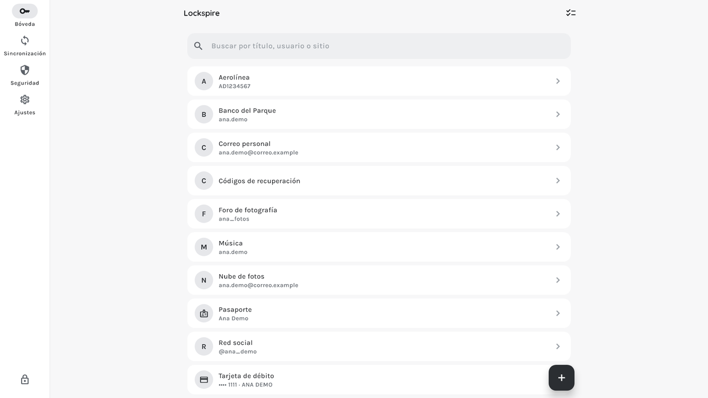
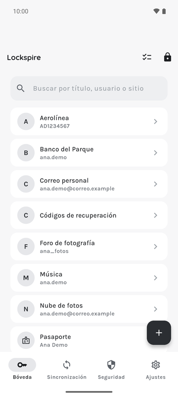

# Lockspire

**Gestor de contraseñas libre, cifrado y sin servidores.** Sus contraseñas, tarjetas, documentos y notas viven en una bóveda cifrada en su dispositivo. Nadie más puede abrirla, tampoco quienes desarrollamos Lockspire.

_[English below](#english)_

## Qué hace

- **Cifrado fuerte:** XChaCha20-Poly1305, con una clave derivada con Argon2id de su contraseña maestra (libsodium). La contraseña maestra nunca se guarda ni se envía a ningún lado.
- **En todos sus dispositivos:** Android, Windows y Linux. Tiene extensión para Chrome y Edge, y autocompletado en Android.
- **Sincronización opcional en su propia nube:** Google Drive, Microsoft OneDrive o su servidor WebDAV. Solo se sube el archivo cifrado, directamente desde su dispositivo.
- **Varios perfiles:** cada persona tiene su propia bóveda en el mismo equipo.
- **Libre:** código abierto bajo licencia AGPLv3, sin anuncios, sin analíticas y sin cuentas.

## Uso de Google Drive

Si usted conecta Google Drive, Lockspire pide solo el permiso `drive.appdata`: una carpeta privada de la aplicación que solo Lockspire puede ver. Ahí guarda y lee **el archivo cifrado de su bóveda**, para sincronizarla entre sus dispositivos. No lee ni ve sus otros archivos, y no comparte ningún dato con nadie. El uso de la información recibida de las API de Google cumple la [Política de datos de usuario de los servicios de API de Google](https://developers.google.com/terms/api-services-user-data-policy), incluidos los requisitos de uso limitado.

## Enlaces

- [Política de privacidad](privacy-policy)
- [Código fuente](https://github.com/Gaanmori/lockspire)
- Contacto: [abra un _issue_ en GitHub](https://github.com/Gaanmori/lockspire/issues)

---

## English

**A free, encrypted password manager with no servers.** Your passwords, cards, documents and notes live in an encrypted vault on your device. Nobody else can open it, including Lockspire's developers.

### What it does

- **Strong encryption:** XChaCha20-Poly1305, with a key derived from your master password with Argon2id (libsodium). Your master password is never stored or sent anywhere.
- **On all your devices:** Android, Windows and Linux, with a Chrome and Edge extension and autofill on Android.
- **Optional sync with your own cloud:** Google Drive, Microsoft OneDrive or your WebDAV server. Only the encrypted file is uploaded, straight from your device.
- **Several profiles:** each person gets their own vault on the same computer.
- **Free:** open source under the AGPLv3 license, with no ads, no analytics and no accounts.

### Google Drive use

If you connect Google Drive, Lockspire requests only the `drive.appdata` scope: a private app folder that only Lockspire can see. It stores and reads **your encrypted vault file** there, to sync it across your devices. It does not read or see your other files and shares no data with anyone. Lockspire's use of information received from Google APIs will adhere to the [Google API Services User Data Policy](https://developers.google.com/terms/api-services-user-data-policy), including the Limited Use requirements.

### Links

- [Privacy policy](privacy-policy#lockspire-privacy-policy)
- [Source code](https://github.com/Gaanmori/lockspire)
- Contact: [open an issue on GitHub](https://github.com/Gaanmori/lockspire/issues)
